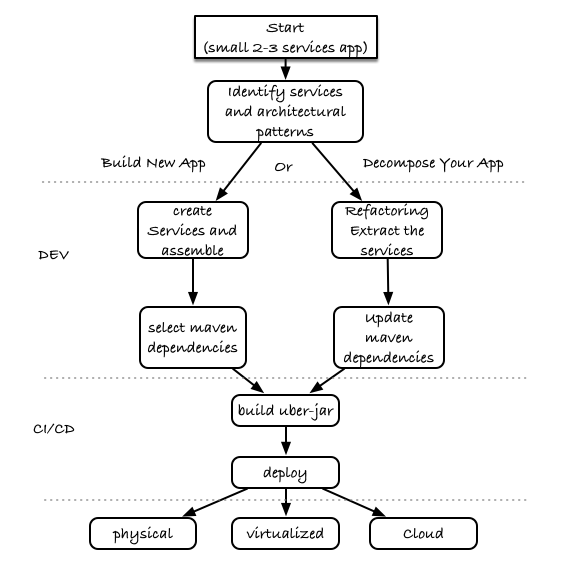
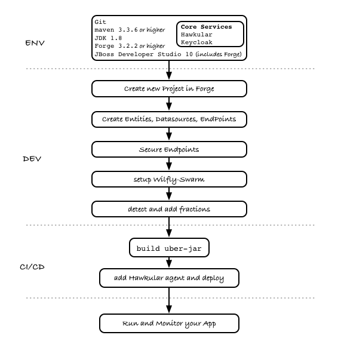

# lab-forge-swarm-keycloak
Lab using Forge / Swarm / KeyCloak
## Hands-on Wildfly Swarm 
 This demo aims to show the necessary steps to create a simple application that consists of a small number of Microservices. The Overall workflow shows an overview of the path one might take to start his/her journey to Microservices. Details in the sections below.

## Overall  Workflow
Basically there are 2 main paths to chose from, either you start from scratch or you decide to decompose an existing application into  set of microservices.
In the next section we will focus on the former, known as greenfiled. Then later on we will explore also how one can take an existing application and transform it to use Wildfly-Swarm.

While a microservices architecture doesn't mandate using a specific language for implemention we decided here to take a pragmatic approach, we will choose the Java EE path with Wildfly-Swarm, then later in our demo, once we completed our basic app, we will explore how these services can interact wih other services that may use Spring Boot, Vert.X, Node.JS or anything you may want to use.
But let's keep that for the last section.

### Demo Workflow - Green field path
As explained earlier this path will be implemented using Wildfly-Swarm. If you want to see how to work with other languages, skip to the last section.

### Demo Workflow - Brown field path
As opposed to the Green Filed path, we are not starting from scratch, rather we are going to focus on keeping our previous investment, and wish the team to stay focused on the same language rather than learning a new one. Again here we will start with Java EE, basing our example on an existing Java EE application that we wish to decompose, while preserving its functionality intact, keep the code untouched and allow the app to benefit from samller footprint and its services to evolve
independently. 

### Extend the Demo with more capabilities
Now we have seen how to implement basic set of services, secure and monitor them, we would like to go one step further with moving those from traditional bare-metal environment to leverage new deployment model and targets. In the table below we explain briefly what capabilities are available in the different target environment to help you understand what you get for free or what you will to bring yourself depending on where you choose to deploy your services.	
In this section we will demonstrate how to move the you build in the previous steps to Openshift and how you can benefit from its built-in capabilities.

[insert table here]
